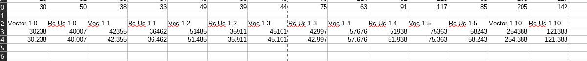

# WHAT ON EARTH IS THIS? 
I am interested in the performance difference when cloning a `Vec<T>` over cloning a `Rc<UnsafeCell<Vec<T>>>`.

Rc returns a pointer to the memory location of the data it wraps vs Cloning an entire vector... you see my point?

So... Rc should be much cheaper compared to cloning an entire vector right..?

## THE SCENARIO

I am literally just smashing stuff together to see if this works, if you think this is horrid please do let me know. 

I have a specific scenario that I would like to benchmark. 
A HashMap that holds a Value of either `Rc<UnsafeCell<Vec<Struct>>>` or 'Vec<Struct>'.
We will iterate every hashmap entry and clone the Value (cursed Rc-Uc-Vec vs Vec).

## THE CURSED EXPERIMENT

So I have set these variables. 

Iterations = 1000

HashMap-Entries : 1  |  Vector-Size: 1..5 & 10;

It took me way too long to benchmark this and I made a few mistakes, such as not deriving clone for `ExampleObject` and mixing up Hashmap-Entry with Vector-size.
All in all I end up learning a lot from short thought experiment :p

